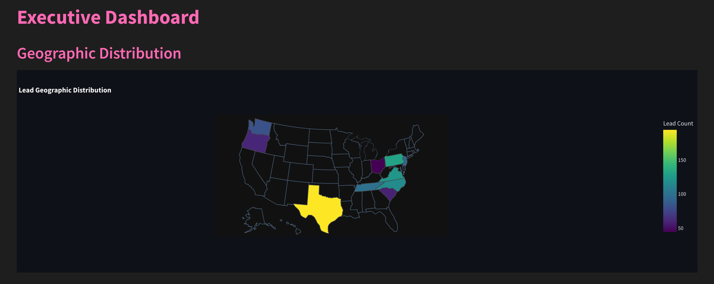
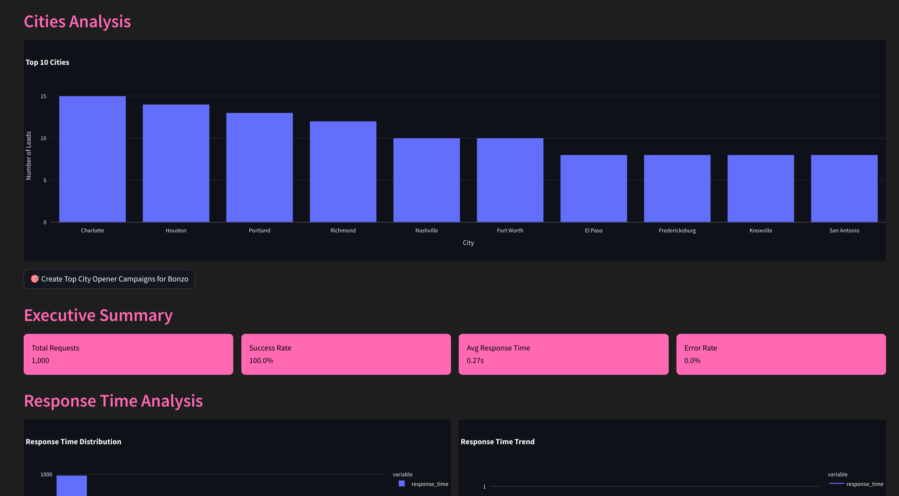
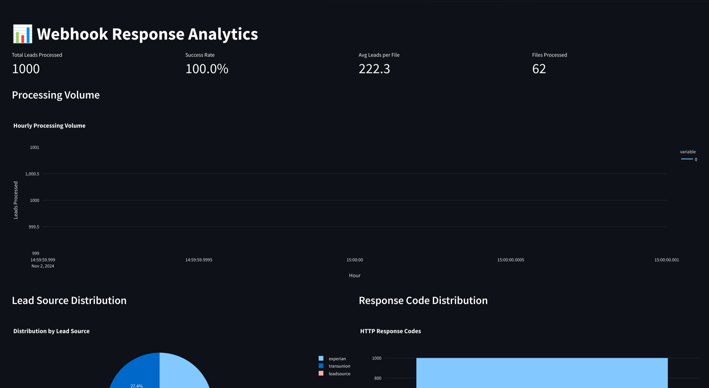
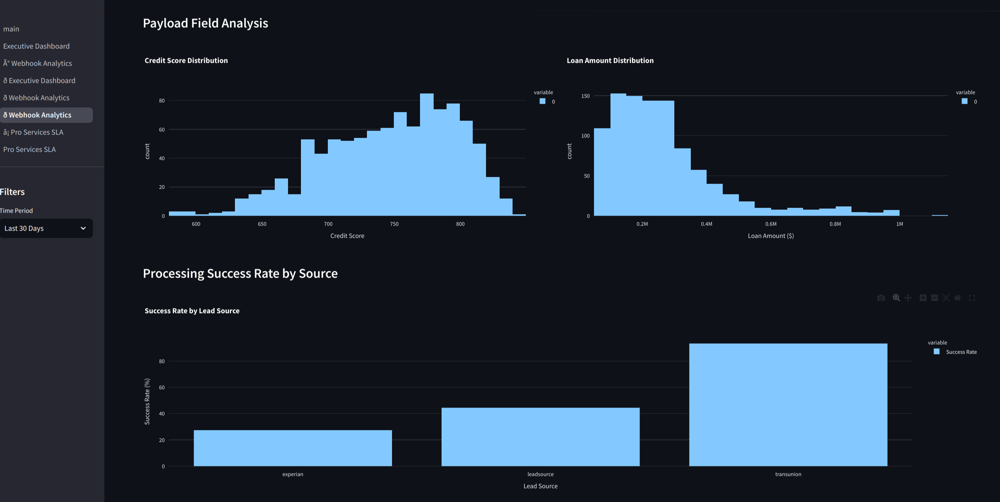
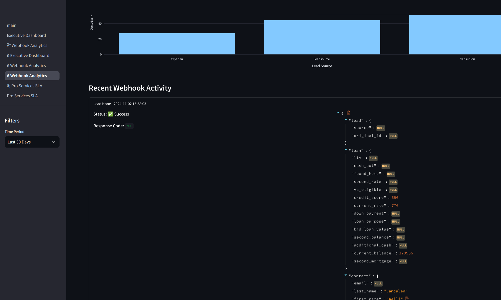
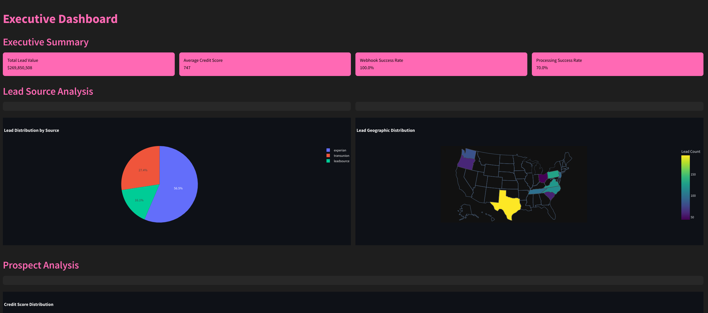
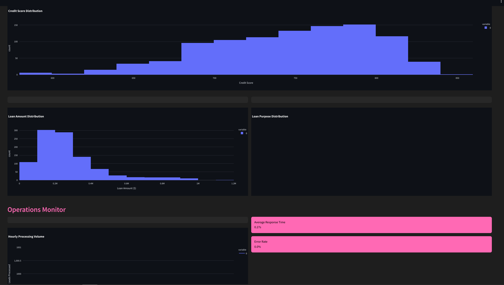
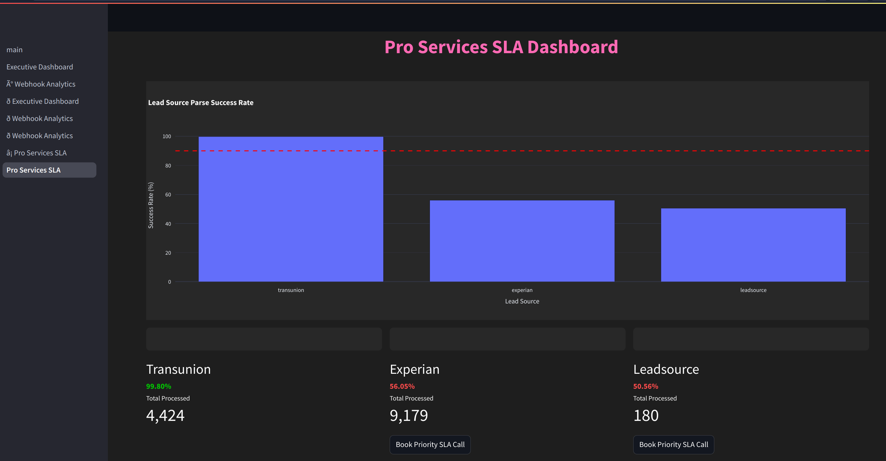

# General Approach for Lead Processing and CRM Integration

## Overview
This approach outlines how a consultant can efficiently process business leads from various sources, parse them, and consistently upload them to Bonzo CRM. It ensures SLA adherence and enables booking access to professional services when SLAs exceed thresholds. Data is stored in a PostgreSQL database as leads are created, allowing for updates to the prospect's journey and additional reporting.

## Key Steps

### Multi-Source Lead Processing
- Develop utilities to parse leads from multiple sources (e.g., Experian, TransUnion, LeadSource).
- Normalize and standardize data to ensure consistency across all sources.

### Integration with Bonzo CRM
- Implement real-time webhook integration to send processed leads to Bonzo CRM.
- Ensure data mappings align with Bonzo's schema for seamless integration.

### SLA Monitoring and Professional Services
- Track SLA adherence for lead processing and response times.
- Enable booking access to professional services if SLAs exceed predefined thresholds.

### Data Storage and Reporting
- Store lead data in a PostgreSQL database for the client being serviced.
- Use stored data to update the prospect's journey and generate detailed reports.

## More Drafts of the Executive Dashboard we Can Link in through Resource Links

## Feature Roadmap for Enhanced Lead Processing and CRM Integration

### Curated Data Management
- Develop utilities to manage and curate tables for active users and campaigns in Bonzo CRM.
- Ensure data consistency and alignment with Bonzo's schema for seamless integration.

### SLA and Performance Monitoring
- Implement tracking for SLA adherence, team performance, and lead source effectiveness.
- Enable professional services to manage critical SLA requirements and provide managed success services.

### On-Premise Deployment Capability
- Extend application deployment to on-premise environments using VMs.
- Utilize FOSS technologies like PostgreSQL to support flexible deployment options.

### Future Analytics with RILL
- Plan for future integration of RILL for advanced analytics on the same VM.
- Use RILL to derive insights into team performance and lead source profitability, as well as campaign performance in converting those leads in success criteria specific to the client being serviced. 

### Authentication with Turso Per-Tenant DB
- Authentication can be added using Turso Per-Tenant DB and Auth Means, deployed as one URL.
- This can be added as a resource link to any Bonzo account, allowing users to have OAuth or better security to access and be served their data.
- Until this feature is ready, we can add Auth to these links during our managed services implementations.

## Data Processing Rules
1. Clean phone numbers to 10 digits.
2. Normalize state codes to uppercase.
3. Convert names to title case.
4. Standardize and combine addresses.
5. Convert credit scores to integers.
6. Properly type boolean fields (e.g., cash_out, found_home).
7. Convert currency values to floats.
8. Validate required fields (email OR phone).

## Error Handling
- Track and export failed records.
- Display specific validation errors for each record.
- Log all webhook responses in the database.
- Handle source-specific parsing errors.

## Deployment
Deploy as a Dockerized container for a Python server/serverless database app:
1. Create a Dockerfile to define the application environment.
2. Build the Docker image using the Dockerfile.
3. Run the Docker container with the necessary environment variables for database connectivity:
   - PGHOST
   - PGDATABASE
   - PGUSER
   - PGPASSWORD
   - PGPORT
4. Use a serverless framework or service to manage the deployment if applicable.
